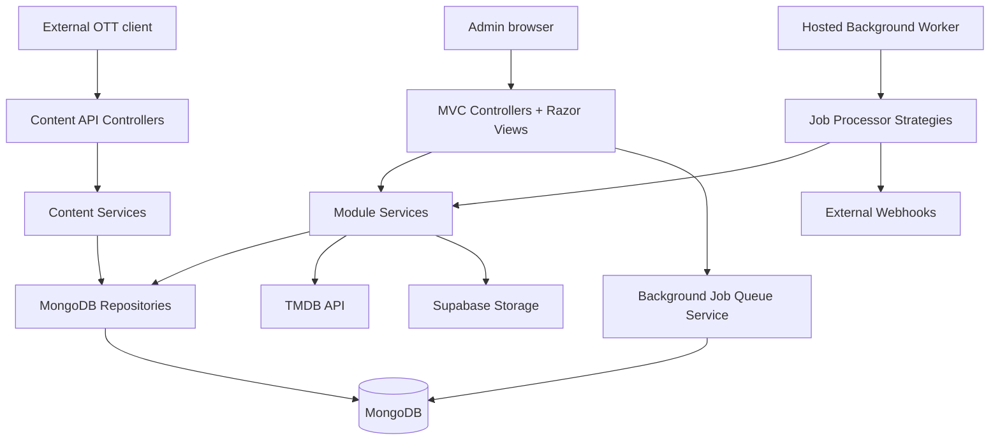
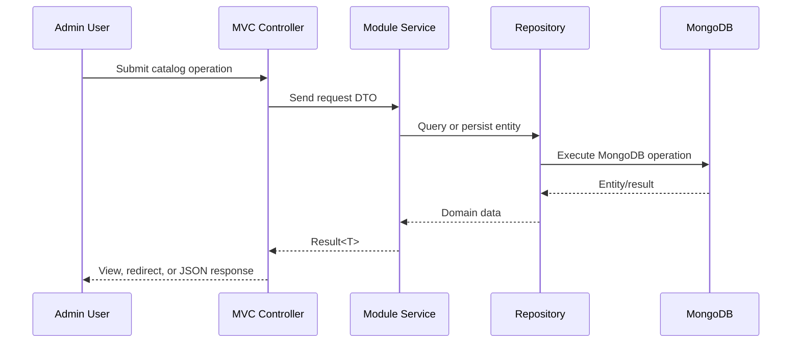
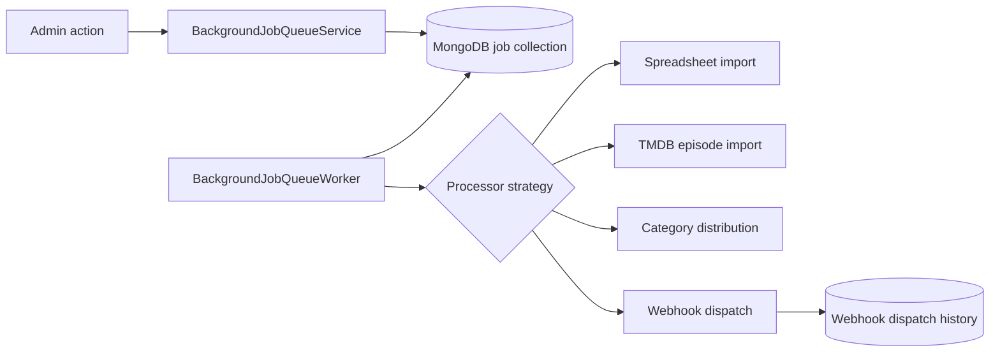
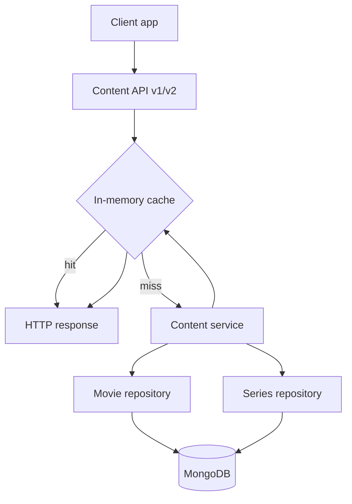

#


XerifeTv CMS is an ASP.NET Core content management system for OTT streaming catalogs. It provides an administrative interface for managing movies, series, episodes, live channels, franchises, users, webhooks, media delivery profiles, and asynchronous import jobs, plus a public Content API for client applications.

The project is built as a modular MVC application with MongoDB persistence, JWT-based sessions, background processing, spreadsheet ingestion, TMDB metadata integration, Supabase file storage, webhook dispatching, audit logging, and OpenAPI documentation.

## Table of Contents

- [Overview](#overview)
- [Features](#features)
- [Architecture](#architecture)
- [Solution Structure](#solution-structure)
- [Technology Stack](#technology-stack)
- [Software Engineering Concepts](#software-engineering-concepts)
- [Design Patterns](#design-patterns)
- [Security](#security)
- [Integrations](#integrations)
- [Background Processing](#background-processing)
- [Content API](#content-api)
- [Screenshots](#screenshots)
- [Folder Structure](#folder-structure)
- [Installation](#installation)
- [Configuration](#configuration)
- [Development](#development)
- [Roadmap](#roadmap)
- [License](#license)

## Overview

XerifeTv CMS solves the operational problem of maintaining a streaming catalog from a back-office interface while also exposing normalized content data to external clients through REST endpoints.

The system is intended for administrators and content operators who need to:

- Register, search, update, disable, and remove catalog content.
- Import large content batches from Excel spreadsheets.
- Enrich movies, series, and episodes with metadata from TMDB using IMDb IDs.
- Manage playback URLs through configurable media delivery profiles.
- Track background job progress and cancel long-running imports.
- Publish content-related webhook events to downstream systems.
- Expose curated movie, series, episode, channel, category, recommendation, and home-screen data through a public API.

The codebase is organized by business modules inside a single ASP.NET Core project. Controllers handle HTTP/UI concerns, services coordinate application behavior, repositories isolate MongoDB access, and shared abstractions provide reusable entities, result handling, pagination, caching, spreadsheet reading, storage, and media value objects.

## Features

### Administration Dashboard

- Dashboard with total movies, series, and channels.
- Current-month content counts.
- Last six months of content registration metrics.
- Latest content activity across movies, series, and channels.
- Latest audit log actions.
- MongoDB storage size reporting through `dbStats`.

### Authentication and Users

- Username/password login.
- Google login strategy support.
- JWT access tokens and refresh tokens.
- HTTP-only secure cookies for session tokens.
- Session refresh flow when protected requests return unauthorized.
- Password reset email flow.
- User registration, update, and deletion.
- User blocking support.
- Role-based access for `ADMIN`, `COMMON`, and `VISITOR`.

### Movies

- Movie listing with pagination.
- Search/filter support.
- Create, update, and delete workflows.
- IMDb ID uniqueness validation.
- TMDB metadata lookup by IMDb ID.
- Categories, review score, release year, synopsis, parental rating, poster, banner, video, trailer, franchise, and media delivery metadata.
- Spreadsheet import with progress monitoring and cancellation.
- Audit logging for create, update, delete, import start, and import cancellation.

### Series and Episodes

- Series listing with pagination.
- Search/filter support.
- Create, update, and delete workflows.
- IMDb ID uniqueness validation.
- Series metadata lookup by IMDb ID through TMDB.
- Season and episode management.
- Episode create, update, and delete workflows.
- Automated episode import by series IMDb ID.
- Spreadsheet import for series and episodes.
- Progress monitoring and cancellation for spreadsheet and episode imports.
- Trailer and franchise support.
- Audit logging for series and episode operations.

### Channels

- Channel listing and management.
- Category support.
- Logo URL and video metadata.
- Media delivery profile integration.
- Spreadsheet import with monitoring and cancellation.
- Channel publication webhook support.

### Franchises

- Franchise search and management.
- Movie and series association through `FranchiseId`.
- Reusable franchise field partial for content forms.

### Media Delivery

- Media delivery profile management.
- URL resolution endpoint for profile-based media paths.
- Fixed URL resolution endpoint.
- Stream format support.
- Token strategies:
  - No token.
  - Static query parameters.
  - Signed query parameters using HMAC-SHA256.

### Webhooks

- Webhook CRUD from the settings area.
- Trigger events for movie, series, and channel publication.
- Configurable HTTP method, headers, URL, and payload template.
- Template keyword replacement from published entities.
- Background webhook dispatch jobs.
- Retry support with up to five attempts.
- Dispatch history with request/response metadata and per-attempt logs.
- Manual redispatch support from webhook history.

### Background Jobs

- MongoDB-backed job queue.
- Hosted worker service.
- Two concurrent jobs by default.
- Job statuses, progress counters, successful/failed counts, and error lists.
- AJAX-powered job list updates.
- Cancellation for pending and running jobs.
- User notification tracking for completed or failed jobs.
- Processor strategies for imports, episode imports, category distribution, and webhook dispatch.

### Public Content API

- Versioned Content API endpoints.
- v1 compatibility endpoints under `/Api/Content`.
- v2 endpoints under `/Api/Content/v2`.
- Movies, series, episodes, categories, grouped categories, search, recommendations, and home content.
- In-memory response caching.
- Encrypted content identifiers/fields where configured through `SecuritySettings:ContentEncryptionKey`.
- Swagger/OpenAPI JSON under `/openapi/v1.json`.
- Scalar API reference UI at `/Api`.

### File and Spreadsheet Handling

- EPPlus-based spreadsheet processing.
- Import templates in `wwwroot/templates`.
- Supabase Storage uploads for spreadsheets and accepted media-related files.
- Accepted storage extensions currently include `.vtt`, `.xlsx`, and `.xls`.

### Audit Logging

- Administrative audit trail for user and content operations.
- Dashboard integration for recent system actions.
- User-scoped audit log retrieval.

### User Interface

- ASP.NET Core MVC with Razor views.
- Bootstrap, jQuery, and unobtrusive validation.
- Shared modals and partials for imports, pagination, video settings, franchises, key/value inputs, webhook forms, and media delivery profiles.
- Subtitle sync bar tooling in the video modal with offset controls and VTT export support.
- Configurable Bootswatch-style theme setting (`cosmo` or `spacelab`).

## Architecture

XerifeTv CMS is a modular monolith. The application is deployed as one ASP.NET Core process, but the code is separated by domain-oriented modules such as `Movie`, `Series`, `Channel`, `User`, `Content`, `Dashboard`, `Integrations`, `Media.Delivery`, `AuditLog`, and `BackgroundJobQueue`.

The dependency flow is intentionally simple:

- Controllers depend on module interfaces and DTOs.
- Services implement application use cases and return `Result<T>`.
- Repositories encapsulate MongoDB queries.
- Shared abstractions provide reusable infrastructure and primitives.
- Background processors reuse the same services and repositories through scoped dependency injection.



### Request Flow



### Background Job Flow



### Content API Flow



## Solution Structure

This repository currently contains one ASP.NET Core project:

| Path | Responsibility |
| --- | --- |
| `XerifeTv.CMS.csproj` | .NET 8 web project and NuGet references. |
| `Program.cs` | Application startup, middleware, CORS, MVC routing, authentication, Swagger, and Scalar setup. |
| `Controllers/` | MVC and API controllers for dashboard, users, catalog modules, settings, storage, background jobs, media delivery, and public Content API. |
| `Modules/` | Business modules, services, repositories, DTOs, entities, importers, strategies, and integrations. |
| `Shared/` | Cross-cutting helpers, MongoDB configuration, dependency injection registration, and controller extensions. |
| `Views/` | Razor views and partials for the admin UI. |
| `wwwroot/` | Static assets, JavaScript, CSS, Excel templates, Bootstrap, jQuery, and validation libraries. |
| `Properties/launchSettings.json` | Local HTTP/HTTPS launch profiles. |
| `Dockerfile` | Multi-stage Docker build for publishing and running the ASP.NET Core application. |

## Technology Stack

### Backend

| Technology | Usage |
| --- | --- |
| C# / .NET 8 | Primary language and runtime. |
| ASP.NET Core MVC | Admin UI and controller routing. |
| Razor Views | Server-rendered management interface. |
| ASP.NET Core Hosted Services | Background job worker. |
| ASP.NET Core Authentication/Authorization | JWT bearer authentication and role-based authorization. |

### Data and Storage

| Technology | Usage |
| --- | --- |
| MongoDB.Driver | Document persistence for content, users, jobs, webhooks, audit logs, and settings. |
| Supabase Storage | Upload target for spreadsheet and media-related files. |
| IMemoryCache | Short-lived API response caching and job cancellation flags. |

### APIs and Documentation

| Technology | Usage |
| --- | --- |
| Swashbuckle.AspNetCore | OpenAPI document generation. |
| Scalar.AspNetCore | API reference UI at `/Api`. |
| TMDB API | Metadata lookup using IMDb IDs. |

### Frontend

| Technology | Usage |
| --- | --- |
| Razor | View composition and partials. |
| Bootstrap | Layout and UI components. |
| jQuery | Interactive UI behavior and AJAX flows. |
| jQuery Validation | Client-side form validation. |

### Import and Utilities

| Technology | Usage |
| --- | --- |
| EPPlus | Excel spreadsheet parsing. |
| System.IdentityModel.Tokens.Jwt | JWT generation and validation. |
| Docker | Containerized publish/runtime environment. |

## Software Engineering Concepts

The following concepts are implemented in the current codebase:

| Concept | Where it appears |
| --- | --- |
| Modular monolith | Business capabilities are grouped under `Modules/*` while deployed as one web app. |
| Layered architecture | Controllers, services, repositories, DTOs, entities, and shared abstractions have separate responsibilities. |
| Dependency injection | `Shared/Extensions/ConfigureServices.cs` registers services, repositories, strategies, and hosted workers. |
| Repository pattern | `BaseRepository<T>` and module repositories isolate MongoDB access. |
| Result pattern | `Modules/Common/Result.cs` standardizes success/failure returns without throwing for expected errors. |
| DTO mapping | Request/response DTOs protect controllers and APIs from direct persistence-model coupling. |
| Specification pattern | User, movie, series, and channel uniqueness checks use specification classes. |
| Strategy pattern | Login providers, media delivery tokens, background processors, and spreadsheet importers use interchangeable strategies. |
| Background processing | `BackgroundJobQueueWorker` processes queued jobs outside the request lifecycle. |
| Cancellation | Spreadsheet and episode imports can be cancelled through cache-backed cancellation flags. |
| Retry policies | Webhook dispatch retries failed calls up to five times with increasing delay. |
| Pagination | `PagedList<T>` and controller pagination support list screens and APIs. |
| Caching | Content API responses and job cancellation flags use `IMemoryCache`. |
| Role-based authorization | Controllers and actions restrict access by `admin` and `common` roles. |
| JWT and refresh tokens | Login produces access and refresh tokens, with a refresh endpoint for expired sessions. |
| Audit logging | Administrative actions write audit entries and feed dashboard activity. |
| External API integration | TMDB is used for metadata lookup and episode import. |
| File storage abstraction | Supabase uploads are accessed through `IStorageFilesService`. |
| OpenAPI documentation | Swagger generation and Scalar UI document the Content API. |

## Design Patterns

| Pattern | Implementation |
| --- | --- |
| Repository | `MovieRepository`, `SeriesRepository`, `ChannelRepository`, `UserRepository`, `WebhookRepository`, and other repositories derive from or follow the base repository abstraction. |
| Strategy | `ILoginStrategy`, `IMediaDeliveryTokenStrategy`, `IBackgroundJobProcessorStrategy`, `ISpreadsheetBatchImporter<T>`, and `IEpisodesImporter`. |
| Template-like shared base | `BaseRepository<T>` centralizes common CRUD, counting, and pagination behavior. |
| Specification | `UniqueUsernameSpecification`, `UniqueEmailSpecification`, `UniqueImdbIdSpecification`, and `UniqueTitleSpecification`. |
| DTO / Mapper methods | DTOs expose `FromEntity` and `ToEntity` mapping methods across modules. |
| Hosted worker | `BackgroundJobQueueWorker` runs as an ASP.NET Core `BackgroundService`. |
| Options pattern | `DBSettings` is bound from `MongoDBConfig`. |

## Security

- Authentication uses ASP.NET Core JWT bearer authentication.
- Tokens are generated by `TokenService`.
- Login supports basic credentials and Google token payload validation through separate strategies.
- Access and refresh tokens are stored in HTTP-only, secure, strict SameSite cookies.
- Authorization is enforced with `[Authorize]` and role constraints across controllers.
- Admin-only areas include user management, settings, webhooks, and media delivery profile management.
- Password hashing is handled through `IHashPassword` using the configured hash salt.
- Password reset uses a reset-code workflow and email delivery.
- Content API response fields can use the configured `SecuritySettings:ContentEncryptionKey`.
- Supabase uploads restrict accepted file extensions.

Important: do not commit real secrets in `appsettings.Development.json`. Use local user secrets, environment variables, or a secrets manager for MongoDB credentials, JWT keys, TMDB keys, Supabase keys, Google OAuth credentials, email passwords, and encryption keys.

## Integrations

| Integration | Purpose |
| --- | --- |
| TMDB API | Movie, series, and episode metadata lookup using IMDb IDs. |
| Supabase Storage | File uploads for import spreadsheets and accepted media-related files. |
| MongoDB | Primary persistence for application data. |
| Google OAuth | Google sign-in support through the Google login strategy. |
| External Webhooks | Outbound content publication events for movies, series, and channels. |
| SMTP-compatible email account | Password reset email delivery. |

## Background Processing

Background jobs are stored in MongoDB and processed by `BackgroundJobQueueWorker`. The worker polls for pending jobs, limits concurrent execution to two jobs, chooses the correct `IBackgroundJobProcessorStrategy`, and updates progress in the job record.

Supported job types:

- `REGISTER_SPREADSHEET_MOVIES`
- `REGISTER_SPREADSHEET_SERIES`
- `REGISTER_SPREADSHEET_CHANNELS`
- `IMPORT_EPISODES_FROM_SERIES_IMDB`
- `CALCULATE_CATEGORY_DISTRIBUTION_FOR_CONTENT_API_MOVIES`
- `CALCULATE_CATEGORY_DISTRIBUTION_FOR_CONTENT_API_SERIES`
- `DISPATCH_WEBHOOKS_MOVIES`
- `DISPATCH_WEBHOOKS_SERIES`
- `DISPATCH_WEBHOOKS_CHANNELS`

The job UI supports filtering, live updates, cancellation, deletion, and completed/failed notifications.

## Content API

The public API is documented through OpenAPI and Scalar.

- Scalar UI: `https://localhost:7222/Api`
- OpenAPI JSON: `https://localhost:7222/openapi/v1.json`

### v2 Endpoints

| Method | Route | Description |
| --- | --- | --- |
| `GET` | `/Api/Content/v2/movies` | Latest movies. |
| `GET` | `/Api/Content/v2/series` | Latest series. |
| `GET` | `/Api/Content/v2/movies/{id}` | Movie detail. |
| `GET` | `/Api/Content/v2/series/{id}` | Series detail. |
| `GET` | `/Api/Content/v2/series/{seriesId}/seasons/{seasonNumber}/episodes` | Episodes by season. |
| `GET` | `/Api/Content/v2/movies/categories` | Movie category list. |
| `GET` | `/Api/Content/v2/series/categories` | Series category list. |
| `GET` | `/Api/Content/v2/movies/category/{category}` | Movies by category with pagination. |
| `GET` | `/Api/Content/v2/series/category/{category}` | Series by category with pagination. |
| `GET` | `/Api/Content/v2/movies/{movieId}/recommended` | Recommended movies. |
| `GET` | `/Api/Content/v2/series/{seriesId}/recommended` | Recommended series. |
| `GET` | `/Api/Content/v2/search?term={term}` | Search movies and series. |
| `GET` | `/Api/Content/v2/home` | Featured content and category groups for a home screen. |
| `GET` | `/Api/Content/v2/movies/categories/groups` | Grouped movies for selected categories. |
| `GET` | `/Api/Content/v2/series/categories/groups` | Grouped series for selected categories. |

### v1 Compatibility Endpoints

| Method | Route | Description |
| --- | --- | --- |
| `GET` | `/Api/Content/Movies` | Movies. |
| `GET` | `/Api/Content/Movies/{category}` | Movies by category. |
| `GET` | `/Api/Content/Series` | Series. |
| `GET` | `/Api/Content/Series/{category}` | Series by category. |
| `GET` | `/Api/Content/Series/Episodes/{serieId}/{season}` | Episodes by series and season. |
| `GET` | `/Api/Content/Channels` | Channels. |
| `GET` | `/Api/Content/Search/{title}` | Search content by title. |

## Screenshots

The repository contains UI assets, but no committed product screenshots were verified during this README rewrite. Capture current screens and replace the placeholders below.

> Screenshot placeholder:
> Dashboard overview
> Capture `Home/Index` after logging in as an administrator.

> Screenshot placeholder:
> Login screen
> Capture `Users/SignIn` showing the basic and Google login options.

> Screenshot placeholder:
> Movie management
> Capture `Movies/Index` with filters, pagination, and import controls.

> Screenshot placeholder:
> Series episodes workflow
> Capture `Series/Episodes` with season filtering and episode actions.

> Screenshot placeholder:
> Background jobs
> Capture `BackgroundJobQueue/Index` showing job status, progress, and cancellation.

> Screenshot placeholder:
> Settings and webhooks
> Capture `Settings/Index` with webhook configuration and dispatch history.

> Screenshot placeholder:
> Scalar API reference
> Capture `/Api` showing the Content API documentation.

## Folder Structure

```text
.
|-- Controllers/
|   |-- ContentAPI/
|   |-- BackgroundJobQueueController.cs
|   |-- ChannelsController.cs
|   |-- MoviesController.cs
|   |-- SeriesController.cs
|   |-- SettingsController.cs
|   `-- UsersController.cs
|-- Modules/
|   |-- Abstractions/
|   |-- AuditLog/
|   |-- Authentication/
|   |-- BackgroundJobQueue/
|   |-- Channel/
|   |-- Common/
|   |-- Content/
|   |-- Dashboard/
|   |-- Franchise/
|   |-- Integrations/
|   |-- Media/
|   |-- Movie/
|   |-- Series/
|   `-- User/
|-- Shared/
|   |-- Database/
|   |-- Extensions/
|   `-- Helpers/
|-- Views/
|-- wwwroot/
|   |-- assets/
|   |-- css/
|   |-- js/
|   |-- lib/
|   `-- templates/
|-- Dockerfile
|-- Program.cs
`-- XerifeTv.CMS.csproj
```

## Installation

### Prerequisites

- .NET SDK 8.0 or later.
- MongoDB instance, local or hosted.
- TMDB API key.
- Supabase project and storage bucket access.
- Google OAuth 2.0 Client ID for web login.
- SMTP-compatible email account for password reset emails.
- Docker, only if running the containerized build.

### Clone and Restore

```bash
git clone https://github.com/GilbertSilvaa/XerifeTv.CMS.git
cd XerifeTv.CMS/XerifeTv.CMS
dotnet restore
```

### Configure Local Settings

Prefer user secrets or environment variables for sensitive values.

```bash
dotnet user-secrets init
dotnet user-secrets set "MongoDBConfig:ConnectionString" "mongodb://localhost:27017"
dotnet user-secrets set "MongoDBConfig:DatabaseName" "xerifetv_content"
dotnet user-secrets set "Jwt:Key" "replace-with-a-long-random-secret"
dotnet user-secrets set "Jwt:ExpirationTimeInMinutes" "60"
dotnet user-secrets set "Jwt:RefreshExpirationTimeInMinutes" "120"
dotnet user-secrets set "Hash:Salt" "replace-with-random-password-salt"
dotnet user-secrets set "Tmdb:Key" "your-tmdb-api-key"
dotnet user-secrets set "Supabase:Url" "https://your-project.supabase.co"
dotnet user-secrets set "Supabase:Key" "your-supabase-key"
dotnet user-secrets set "OAuth2Google:ClientId" "your-google-client-id.apps.googleusercontent.com"
dotnet user-secrets set "EmailSettings:From" "your-email@example.com"
dotnet user-secrets set "EmailSettings:Password" "your-email-app-password"
dotnet user-secrets set "SecuritySettings:ContentEncryptionKey" "64-hex-character-key"
dotnet user-secrets set "baseUrl" "https://localhost:7222/"
```

### Build and Run

```bash
dotnet build
dotnet run
```

Default local profiles:

- HTTP: `http://localhost:5003`
- HTTPS: `https://localhost:7222`
- API reference: `https://localhost:7222/Api`

### Run with Docker

Build the image:

```bash
docker build -t xerifetv-cms .
```

Run the container with environment variables:

```bash
docker run --rm -p 8080:80 \
  -e ASPNETCORE_ENVIRONMENT=Production \
  -e MongoDBConfig__ConnectionString="mongodb://host.docker.internal:27017" \
  -e MongoDBConfig__DatabaseName="xerifetv_content" \
  -e Jwt__Key="replace-with-a-long-random-secret" \
  -e Jwt__ExpirationTimeInMinutes="60" \
  -e Jwt__RefreshExpirationTimeInMinutes="120" \
  -e Hash__Salt="replace-with-random-password-salt" \
  -e Tmdb__Key="your-tmdb-api-key" \
  -e Supabase__Url="https://your-project.supabase.co" \
  -e Supabase__Key="your-supabase-key" \
  -e OAuth2Google__ClientId="your-google-client-id.apps.googleusercontent.com" \
  -e EmailSettings__From="your-email@example.com" \
  -e EmailSettings__Password="your-email-app-password" \
  -e SecuritySettings__ContentEncryptionKey="64-hex-character-key" \
  -e baseUrl="http://localhost:8080/" \
  xerifetv-cms
```

The application adds `http://*:80` outside Development, so map host ports to container port `80`.

## Configuration

| Key | Required | Description |
| --- | --- | --- |
| `MongoDBConfig:ConnectionString` | Yes | MongoDB connection string. |
| `MongoDBConfig:DatabaseName` | Yes | MongoDB database name. |
| `Jwt:Key` | Yes | Signing key for access and refresh tokens. |
| `Jwt:Issuer` | Yes | JWT issuer. Defaults to `Xerifetvcms` in `appsettings.json`. |
| `Jwt:Audience` | Yes | JWT audience. Defaults to `Xerifetvcms` in `appsettings.json`. |
| `Jwt:ExpirationTimeInMinutes` | Yes | Access token lifetime. |
| `Jwt:RefreshExpirationTimeInMinutes` | Yes | Refresh token lifetime. |
| `Hash:Salt` | Yes | Salt used by password hashing. |
| `Tmdb:Key` | Yes | TMDB API key used for IMDb/TMDB metadata lookups. |
| `Supabase:Url` | Yes | Supabase project URL. |
| `Supabase:Key` | Yes | Supabase API key. |
| `EPPlus:ExcelPackage:LicenseContext` | Yes | EPPlus license context. Current config uses `NonCommercial`. |
| `EmailSettings:From` | Yes | Sender email for password reset. |
| `EmailSettings:Password` | Yes | Email password or app password. |
| `OAuth2Google:ClientId` | Yes for Google login | Google OAuth web client ID. |
| `SecuritySettings:ContentEncryptionKey` | Yes for Content API encryption | Key used by content response DTOs. |
| `baseUrl` | Yes | Public base URL used by email and callback flows. |
| `Theme` | No | UI theme value. Current supported values are `cosmo` and `spacelab`. |

## Development

Useful commands:

```bash
dotnet restore
dotnet build
dotnet run
dotnet publish -c Release -o out
```

There are no test projects in the current repository. If tests are added, place them in separate test projects and document the command here, for example `dotnet test`.

When adding a new module, follow the existing structure:

1. Add the entity, DTOs, interfaces, service, and repository under `Modules/<ModuleName>`.
2. Register interfaces and implementations in `Shared/Extensions/ConfigureServices.cs`.
3. Add a controller under `Controllers/` for UI or API entry points.
4. Add Razor views under `Views/<ModuleName>` if the module has an administrative UI.
5. Use `Result<T>` for expected application outcomes.
6. Keep MongoDB access inside repositories.
7. Add audit logging for administrative state changes.
8. Add background job strategies when work should not run inside the request lifecycle.

## Roadmap

Potential next improvements based on the current repository state:

- Add automated unit and integration tests for services, repositories, importers, and Content API endpoints.
- Add CI for build validation and test execution.
- Move development secrets out of committed configuration files.
- Add `docker-compose.yml` for MongoDB plus the CMS.
- Add seeded administrator creation for first local startup.
- Add structured logging sinks and production observability.
- Add a committed license file if the project is intended to be open source.

## License

No license file is currently present in the repository. Add a `LICENSE` file before distributing this project as open source.
